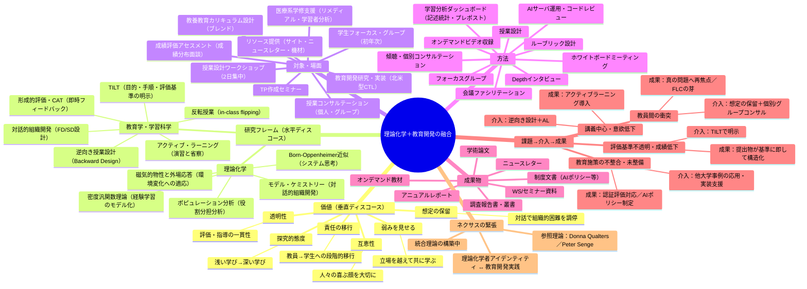
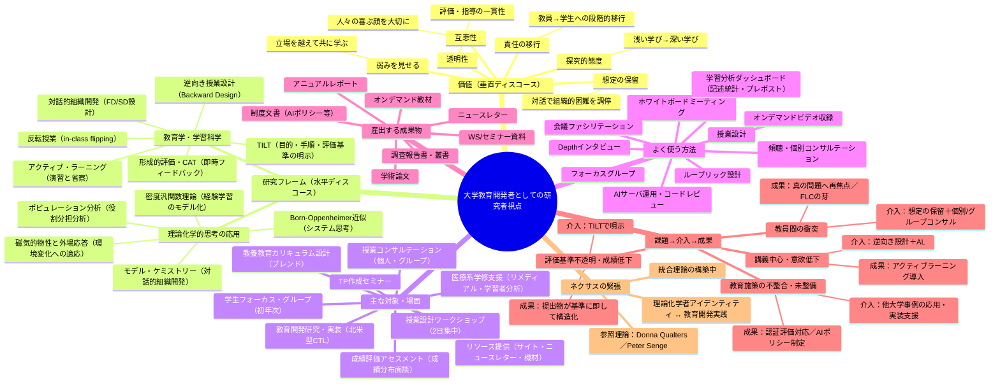
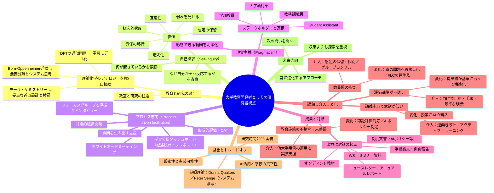

```mermaid
mindmap
  root((理論化学＋教育開発の融合))
    価値（垂直ディスコース）
      透明性
        評価・指導の一貫性
      責任の移行
        教員→学生への段階的移行
      探究的態度
        浅い学び→深い学び
      弱みを見せる
        立場を越えて共に学ぶ
      想定の保留
        対話で組織的困難を調停
      互恵性
        人々の喜ぶ顔を大切に
    研究フレーム（水平ディスコース）
      理論化学
        密度汎関数理論（経験学習のモデル化）
        Born-Oppenheimer近似（システム思考）
        モデル・ケミストリー（対話的組織開発）
        ポピュレーション分析（役割分担分析）
        磁気的物性と外場応答（環境変化への適応）
      教育学・学習科学
        アクティブ・ラーニング（演習と省察）
        対話的組織開発（FD/SD設計）
        反転授業（in-class flipping）
        TILT（目的・手順・評価基準の明示）
        形成的評価・CAT（即時フィードバック）
        逆向き授業設計（Backward Design）
    対象・場面
      授業コンサルテーション（個人・グループ）
      授業設計ワークショップ（2日集中）
      医療系学修支援（リメディアル・学習者分析）
      学生フォーカス・グループ（初年次）
      成績評価アセスメント（成績分布面談）
      教育開発研究・実装（北米型CTL）
      教養教育カリキュラム設計（ブレンド）
      TP作成セミナー
      リソース提供（サイト・ニュースレター・機材）
    方法
      ホワイトボードミーティング
      会議ファシリテーション
      授業設計
      ルーブリック設計
      フォーカスグループ
      Depthインタビュー
      学習分析ダッシュボード（記述統計・プレポスト）
      AIサーバ運用・コードレビュー
      オンデマンドビデオ収録
      傾聴・個別コンサルテーション
    成果物
      WS/セミナー資料
      オンデマンド教材
      ニュースレター
      アニュアルレポート
      制度文書（AIポリシー等）
      学術論文
      調査報告書・叢書
    課題→介入→成果
      評価基準不透明・成績低下
        介入：TILTで明示
        成果：提出物が基準に即して構造化
      講義中心・意欲低下
        介入：逆向き設計＋AL
        成果：アクティブラーニング導入
      教員間の衝突
        介入：想定の保留＋個別/グループコンサル
        成果：真の問題へ再焦点／FLCの芽
      教育施策の不整合・未整備
        介入：他大学事例の応用・実装支援
        成果：認証評価対応／AIポリシー制定
    ネクサスの緊張
      理論化学者アイデンティティ ↔ 教育開発実践
      参照理論：Donna Qualters／Peter Senge
      統合理論の構築中
```

``` mermaid
mindmap
  root((大学教育開発者としての研究者視点))
    価値（垂直ディスコース）
      透明性
        評価・指導の一貫性
      責任の移行
        教員→学生への段階的移行
      探究的態度
        浅い学び→深い学び
      弱みを見せる
        立場を越えて共に学ぶ
      想定の保留
        対話で組織的困難を調停
      互恵性
        人々の喜ぶ顔を大切に
    研究フレーム（水平ディスコース）
      理論化学的思考の応用
        密度汎関数理論（経験学習のモデル化）
        Born-Oppenheimer近似（システム思考）
        モデル・ケミストリー（対話的組織開発）
        ポピュレーション分析（役割分担分析）
        磁気的物性と外場応答（環境変化への適応）
      教育学・学習科学
        アクティブ・ラーニング（演習と省察）
        対話的組織開発（FD/SD設計）
        反転授業（in-class flipping）
        TILT（目的・手順・評価基準の明示）
        形成的評価・CAT（即時フィードバック）
        逆向き授業設計（Backward Design）
    主な対象・場面
      授業コンサルテーション（個人・グループ）
      授業設計ワークショップ（2日集中）
      医療系学修支援（リメディアル・学習者分析）
      学生フォーカス・グループ（初年次）
      成績評価アセスメント（成績分布面談）
      教育開発研究・実装（北米型CTL）
      教養教育カリキュラム設計（ブレンド）
      TP作成セミナー
      リソース提供（サイト・ニュースレター・機材）
    よく使う方法
      ホワイトボードミーティング
      会議ファシリテーション
      授業設計
      ルーブリック設計
      フォーカスグループ
      Depthインタビュー
      学習分析ダッシュボード（記述統計・プレポスト）
      AIサーバ運用・コードレビュー
      オンデマンドビデオ収録
      傾聴・個別コンサルテーション
    産出する成果物
      WS/セミナー資料
      オンデマンド教材
      ニュースレター
      アニュアルレポート
      制度文書（AIポリシー等）
      学術論文
      調査報告書・叢書
    課題→介入→成果
      評価基準不透明・成績低下
        介入：TILTで明示
        成果：提出物が基準に即して構造化
      講義中心・意欲低下
        介入：逆向き設計＋AL
        成果：アクティブラーニング導入
      教員間の衝突
        介入：想定の保留＋個別/グループコンサル
        成果：真の問題へ再焦点／FLCの芽
      教育施策の不整合・未整備
        介入：他大学事例の応用・実装支援
        成果：認証評価対応／AIポリシー制定
    ネクサスの緊張
      理論化学者アイデンティティ ↔ 教育開発実践
      参照理論：Donna Qualters／Peter Senge
      統合理論の構築中
```

``` mermaid
mindmap
  root((大学教育開発者としての研究者視点))
    教育と研究の融合
      教室と研究の往還
      理論化学のアナロジーをFDに接続
        DFTの近似階層 → 学習モデル化
        Born-Oppenheimer近似 → 要因分離とシステム思考
        モデル・ケミストリー → 妥当な近似設計と検証
    自己探求（Self-inquiry）
      何が起きているかを観察
      なぜ自分がそう反応するかを省察
      価値
        透明性
        責任の移行
        探究的態度
        弱みを見せる
        想定の保留
        互恵性
    プロセス志向（Process-driven facilitation）
      質問を生み出す支援
      対話的組織開発
      フォーカスグループと深掘りインタビュー
      ホワイトボードミーティング
      形成的評価・CAT
      学習分析ダッシュボード（記述統計・プレポスト）
    現実主義（Pragmatism）
      影響できる範囲を明確化
      ステークホルダーと連携
        大学執行部
        教務課職員
        学部教員
        Student Assistant
    成果と対話
      出力は対話の起点
        制度文書（AIポリシー等）
        WS・セミナー資料
        オンデマンド教材
        ニュースレター／アニュアルレポート
        学術論文・調査報告
    課題→介入→変化
      評価基準が不透明
        介入：TILTで目的・手順・基準を明示
        変化：提出物が基準に沿って構造化
      講義中心で意欲が低い
        介入：逆向き設計＋アクティブ・ラーニング
        変化：授業にALが導入
      教員間の衝突
        介入：想定の保留＋個別／グループコンサル
        変化：真の問題へ再焦点化／FLCの芽生え
      教育施策の不整合・未整備
        介入：他大学事例の適用と実装支援
        変化：認証評価対応／AIポリシー制定
    緊張とトレードオフ
      研究時間とFD実装
      厳密性と実装可能性
      AI活用と学修の真正性
      参照理論：Donna Qualters／Peter Senge（システム思考）
    未来志向
      常に進化するアプローチ
      次の問いを開く
      収束よりも探索を重視
```
