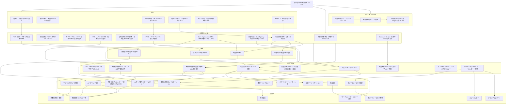

```mermaid
flowchart TD
  %% =========================
  %% 中核テーマ
  %% =========================
  A[研究者主導の教育開発フレーム]

  %% =========================
  %% 価値（垂直ディスコース）
  %% =========================
  subgraph Values[価値]
    V1[透明性：評価と指導の一貫性]
    V2[責任の移行：教員から学生へ段階的に]
    V3[探究的態度：浅い学びから深い学びへ]
    V4[弱みを見せる：立場を越え共に学ぶ]
    V5[想定の保留：対話で組織的困難を調停]
    V6[互恵性：人々の喜ぶ顔を大切に]
  end

  A --> Values

  %% =========================
  %% 研究フレーム（水平ディスコース）
  %% =========================
  subgraph Frames[研究フレーム]
    %% 理論化学由来
    F1[密度汎関数理論：経験学習のモデル化]
    F2[Born-Oppenheimer近似：要因分離とシステム思考]
    F3[モデル・ケミストリー：妥当な近似の設計と検証]
    F4[ポピュレーション分析：役割寄与の定量化]
    F5[磁気的物性と外場応答：環境変化への適応設計]

    %% 教育学・学習科学
    F6[アクティブ・ラーニング：演習と省察]
    F7[対話的組織開発：協働と合意形成]
    F8[反転授業 in-class flipping：授業内での実演と応用]
    F9[TILT：目的・手順・評価基準の明示]
    F10[形成的評価・CAT：即時フィードバック]
    F11[Backward Design：成果からの逆向き設計]
  end

  A --> Frames

  %% 価値 -> 研究フレームの整合
  V1 --> F9
  V2 --> F10
  V3 --> F6
  V4 --> F7
  V5 --> F2
  V6 --> F7

  %% =========================
  %% 対象・場面
  %% =========================
  subgraph Contexts[対象・場面]
    C1[授業コンサルテーション]
    C2[授業設計ワークショップ 2日間]
    C3[医療系学修支援 リメディアルと学習者分析]
    C4[学生フォーカスグループ 初年次アセスメント]
    C5[成績評価アセスメント 成績分布に基づく面談]
    C6[教育開発研究と実装 北米型CTLの日本化]
    C7[教養教育カリキュラム設計 ブレンド学習]
    C8[ティーチングポートフォリオ作成セミナー]
    C9[リソース提供 サイト・ニュースレター・機材]
  end

  Frames --> C1
  Frames --> C2
  F2 --> C3
  F4 --> C4
  F11 --> C7
  F7 --> C6
  F8 --> C1

  %% =========================
  %% 方法
  %% =========================
  subgraph Methods[方法]
    M1[ホワイトボードミーティング]
    M2[会議ファシリテーション]
    M3[授業設計]
    M4[ルーブリック設計]
    M5[フォーカスグループ運営]
    M6[深掘りインタビュー]
    M7[学習分析ダッシュボード 記述統計とプレポスト]
    M8[AIサーバ運用とコードレビュー]
    M9[オンデマンドビデオ収録]
    M10[傾聴と個別コンサルテーション]
  end

  C1 --> M3
  C2 --> M4
  C4 --> M5
  C3 --> M7
  C6 --> M8
  C1 --> M10
  C2 --> M1
  C2 --> M2
  C9 --> M9

  %% =========================
  %% 成果物
  %% =========================
  subgraph Outputs[成果物]
    O1[ワークショップ・セミナー資料]
    O2[オンデマンドビデオ教材]
    O3[ニュースレター]
    O4[アニュアルレポート]
    O5[制度文書 AIポリシー等]
    O6[学術論文]
    O7[調査報告書・叢書]
  end

  M3 --> O1
  M4 --> O5
  M9 --> O2
  M8 --> O5
  M8 --> O6
  M5 --> O7
  C9 --> O3
  C9 --> O4

  %% =========================
  %% 課題 -> 介入 -> 成果
  %% =========================
  subgraph Problems[課題]
    P1[評価基準が不透明で成績が低下]
    P2[講義中心で意欲が低い]
    P3[教員間の衝突]
    P4[教育施策の不整合や未整備]
  end

  %% 研究フレームが課題認識を導く
  F9 --> P1
  F10 --> P1
  F6 --> P2
  F7 --> P3
  F2 --> P3
  F7 --> P4

  %% 介入（方法・場面）と成果物
  P1 --> M4 --> O5
  P2 --> C2 --> O1
  P3 --> M10
  P4 --> C6 --> O5

  %% =========================
  %% ネクサスの緊張（背景情報）
  %% =========================
  subgraph Nexus[研究と教育の緊張]
    N1[理論化学者としてのアイデンティティ]
    N2[教育開発者としての実践]
    N3[指導仮説: Qualters と Senge に基づく統合]
  end
  N1 --- N2
  N2 --> N3
  A --- Nexus
```
