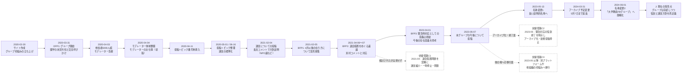

```mermaid
flowchart LR
    %% 時間軸に沿った主径路（実線）

    J0[2020-03-30<br/>サイト作成<br/>グループ枠組みの立ち上げ]
    J1[2020-03-31<br/>OPP1: グループ開始<br/>関学の状況共有と交流呼びかけ]
    J2[2020-04-03<br/>参加者5000人超<br/>モデレーター急募]
    J3[2020-04-04<br/>モデレーター体制整備<br/>モデレーターのお仕事（初版）]
    J4[2020-04-11<br/>投稿トピック番号制導入]
    J5[2020-05-01 / 06-16<br/>投稿トピック整理<br/>運営の標準化]
    J6[2021-02-04<br/>運営についての投稿<br/>長文コメントで方針説明（NPO論など）]
    J7[2021-02-05<br/>BFP1: 4月以後の在り方について意見募集]
    J8[2021-04-06〜07<br/>BFP2: 退会措置をめぐる議論<br/>米村コメントと対応]
    J9[2023-04-01<br/>BFP3: 緊急時対応としての意義は終結<br/>今後の存在意義を再考]
    J10[2023-05-07<br/>本グループの今後について投稿]
    J11[2023-05-13<br/>名称変更1<br/>長い説明的名称へ]
    J12[2024-03-31<br/>アーカイブ予定変更<br/>5月7日まで延長]
    J13[2024-06-01<br/>名称変更2<br/>「大学教員FBグループ」へ簡略化]
    EFP[J: 現在の等至点<br/>グループは存続しつつ<br/>役割と運営方針を再定義]

    J0 --> J1 --> J2 --> J3 --> J4 --> J5 --> J6 --> J7 --> J8 --> J9 --> J10 --> J11 --> J12 --> J13 --> EFP

    %% 伏線径路（点線）：その時点で現実味があった別径路

    A1[伏線径路C1<br/>2021-04：退会措置問題を契機に<br/>運営縮小・一時停止・閉鎖]
    A2[伏線径路C2<br/>2023-05：緊急対応の役割終了を明示し<br/>アーカイブ化・新規投稿停止]
    A3[伏線径路C3<br/>2023-05 以降：別プラットフォームや<br/>他組織の枠組みへ移行]

    %% 主径路からの分岐として描画
    J8 -.検討されたが実現せず.-> A1
    J10 -.アーカイブ化・終了案.-> A2
    J10 -.他の場への移行案.-> A3

    %% 装飾：伏線径路を点線スタイルに
    classDef alt stroke-dasharray: 5 5,stroke:#555,fill:#ffffff;
    class A1,A2,A3 alt;
```
New File at notes · kimikazu/ks-academic-constellation
